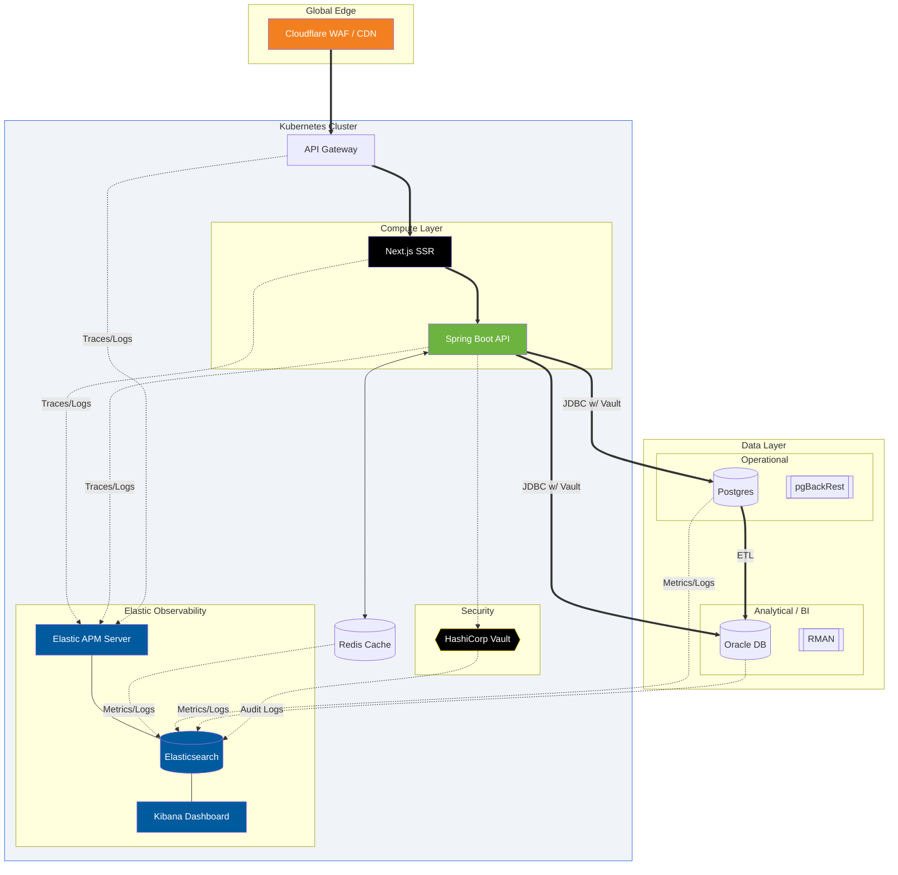
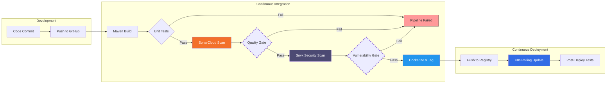

## Hi, I'm Béla 👋
### **Solutions Architect | Senior Java Developer | Former Oracle DBA**
                          

I build enterprise-grade systems where **high-performance code** meets **bulletproof data architecture**. With over a decade of experience—ranging from managing 1,000+ production systems to architecting cloud-native Java microservices—I bridge the gap between complex backend logic and robust infrastructure.

## 🏗️ My Ideal Enterprise Stack
This architecture represents my "gold standard" for a secure, scalable, and observable production environment. It reflects my philosophy: **Security by design, data integrity by default, and total observability**.

## 🛠️ Core Competencies

### Architectural Strategy
- Distributed Systems: Designing microservices with Spring Boot and Kubernetes, ensuring high availability and seamless communication via API Gateways.
- Data Engineering: Expert-level database design, moving from transactional (OLTP) to analytical (OLAP) via custom ETL processes and Snowflake schemas wether it is based on PostgreSQL or ORACLE, means no problem.

### Security & Performance
- Secret Management: Implementing HashiCorp Vault for dynamic database credential rotation and zero-trust security.
- Observability: Full-stack monitoring using the Elastic (ELK) Stack and APM for distributed tracing across services.
- Caching: Optimizing application throughput with Redis to reduce database contention and latency.

### Coding & Framework Expertise
- **Spring Ecosystem**: Extensive experience with Spring Boot, Spring Security, Spring Data, and Spring Cloud for building resilient, cloud-native applications.
- **Database Migrations**: Expert use of Flyway for version-controlled, automated database schema changes, ensuring parity across Dev, Test, and Prod.
- **Modern Java**: Proficient in leveraging the latest Java features to write clean, maintainable, and high-performance code.
- **NextJS**: well, here I have to tell, I am not the UI expert. Yet, I can manage myself comfortably among divs and buttons... 🤿

### Observability (ELK Stack)
- **Full-Stack Monitoring**: Implementing Elastic APM for distributed tracing across Next.js and Spring Boot.
- **Visualization & Insights**: Creating advanced Kibana dashboards to monitor system health, audit logs, and business metrics in real-time.

### CI/CD & DevOps Automation
- **Automated Security**: Integrating Snyk into the pipeline for real-time vulnerability scanning of dependencies and container images.
- **Code Quality & Governance**: Leveraging SonarQube / SonarCloud to enforce high standards through static code analysis, identifying technical debt and security hotspots.
- **Orchestration**: Proficient in GitHub Actions, TeamCity, and Jenkins for managing complex build and deployment lifecycles. And once I saw a Bamboo deployment... 🎍😄

A pipeline with which I could live with, would look something like:

### The DBA Heritage
- **Disaster Recovery**: Implementing professional-grade backup strategies using pgBackRest for Postgres and RMAN for Oracle.
- **Tuning**: Deep performance tuning of Oracle 10g-21c RAC environments, including High Availability (Data Guard) ASM and Grid Control, with similar mindset when it comes to open source: hands on experience with PostgreSQL since version 10.
- **Stored procedures, JSON, custom data types, XML**: yes, we need to talk about these, eventho everyone would get rid of them, at a certain point, they somehow appear in the database :eyes:. If done with right, they **CAN** be part of a performant production environment. Imho key is to document them properly, and use them with caution. Been there, done that :godmode:

### Methodologies & Standards
- **Enterprise Architecture (TOGAF)**: Applying the ADM (Architecture Development Method) to align IT strategy with business goals, ensuring scalable and modular system evolution.
- **Compliance & Quality (ISO)**: Experienced in architecting systems that adhere to ISO standards (such as **ISO 27001** for security or **ISO 9001** for quality management), critical for Luxembourg's financial and regulatory environments.
- **Agile & Scrum**: Deeply rooted in Agile mindsets. I advocate for **Scrum frameworks** to drive iterative development, ensuring rapid feedback loops and high-quality deliverables in hybrid and cross-functional teams.

### Experience Highlights
- **Solutions Architect**: Currently leading the evolution of energy market auction platforms and data exchange API-s in Luxembourg.
- **Senior Java Developer**: Specialist in the Spring ecosystem (Boot, Data, Security, Cloud).
- **Database Administrator**: Supported 1000+ production RAC databases across EMEA, focusing on 24/7 uptime and extreme performance tuning.

### Education
- BSc Software Information Technology
- Oracle Database 11g: SQL Fundamentals I
- Oracle Database 11g: Administration I
- Oracle Database 11g: Administration II
- Upgrade to Oracle Database 12c
- Kubernetes for App Developers (LFD459)
- Certified Kubernetes Application Developer
- TOGAF® Enterprise Architecture Foundation
- Currently chasing AZ-204 Developing Solutions for Microsoft Azure certificates

## 🕹️ Outside the IDE
While my professional life is spent at the computer, I like to spend even more time close to it 😲... I’m a dedicated gamer who enjoys the tactical side of play. It’s my favorite way to reset, while having fun with my friends online. My other hobbies are cycling, hiking with my family and friends, or reading a good book, well or even a bad one 😄, and discuss it later with someone.
  
## 📫 Let's Connect
I'm always interested in discussing complex system design, Kubernetes orchestration, or the future of Java, in the growing shade of the mighty AI :robot:, **our field of work is changing**. Changing ever since I stepped onto this path a decade ago, and will be doing exactly that in the future. But in the end, isn't this the very reason why it is so interesting :fire:?

